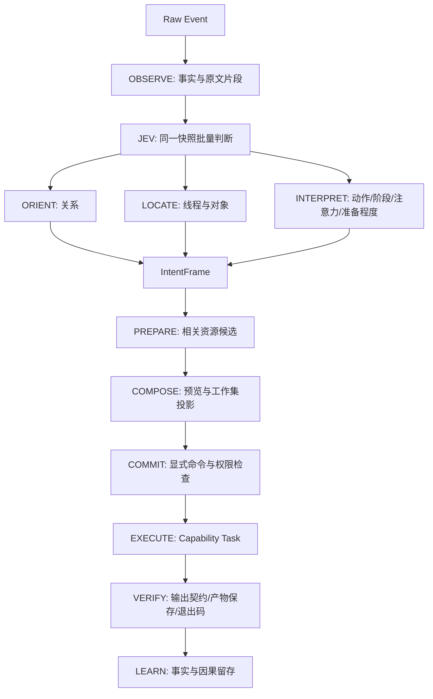

# Intent Runtime Protocol v0.2

状态：可执行的有界语义判断、候选预览与显式提交；完整自适应桌面仍在推进。

## 核心约束

Intent 保存一件事的持久身份；IntentFrame 保存某次输入的七个正交判断。所有模块仍只交换 EVENT / SIGNAL / COMMAND / RESULT。JEV 不能执行 Capability，READY 也不是执行授权。

- ThreadRelation：CONTINUE / CORRECT / BRANCH / RETURN / NEW / MERGE / CLOSE。
- Operation：OBSERVE / RETRIEVE / CREATE / MODIFY / EXECUTE / COMMUNICATE / ORGANIZE / COMPARE / CONTROL。
- Target：有界候选 Artifact ID，或 NONE；显式选择优先。
- Phase：EXPLORE / FORM / ACT / VERIFY / WAIT / HANDOFF，共六种。
- Attention：FOREGROUND / EDGE / BACKGROUND / PARKED / INTERRUPT。
- Commitment：HYPOTHESIS / PREPARED / PREVIEW / READY / COMMITTED；模型不能选择 COMMITTED，中间 ASR 转写强制 HYPOTHESIS。
- Thread：已有 Intent ID，或 NONE。BRANCH/NEW 只产生建议。

## 执行图

`control.py` 在单次请求里批量提出独立问题，再按十个阶段投影结构化输出。每个阶段有 `node-*.schema.json` 输入/输出契约。`control-run` 的 COMMIT/EXECUTE/VERIFY 在语义预览时保持 waiting；真正执行由后续命令及 Task 日志记录，不把准备记录伪装成已发生的动作。

### 消息入口

- `event.observe {event, analyze}`：记录事实；可选择启动语义任务。事件含 type/source/text/final，可有 stream/sequence/observedAt/facts/selectedArtifact。
- `semantic.observe {text, event?}`：已有胶囊兼容入口。
- `frame.commit {frame, capability, input, grant?, provider?}`：人明确选择实际能力与参数；检查候选归属、过期、状态版本、未解决引用和重复提交，再经过既有权限检查。当前只支持已确认属于当前线程的 CONTINUE/CORRECT；其他拓扑变化先由明确的 Intent 命令完成。
- `intent.transition {lifecycle}`：DORMANT/WARM/FOREGROUND/BACKGROUND/PARKED/CLOSED，关闭保留内容。
- `control.completed` / `observation.recorded` / `intent.transitioned` / `task.verified`：新事实事件。

### 稳定性与优先级

当前线程优先；最多 8 个 Intent、12 个对象、4 个原文片段。先排序再截取，显式选中对象优先于 HOT/WARM。模型必须选择已声明 ID；跨线程引用、不明目标、切分不足会标记 unresolved。不会猜测执行参数或自动扩大权限。

中间转写采用 stream + sequence；新序列使在途旧结果失效。状态版本、产物版本、读取深度、最新请求 ID 同时参与旧响应检查。用户设置阶段、固定对象、手动工作集、已处理通知优先于语义结果。通知紧急度独立于相关性；相关性不授予权限。

### 执行与验证

实际 Task 仍由确定性调度器和 Permission Broker 管理。`verification.scope=local-output` 只验证输出契约、产物持久化及适用时的进程退出码；`goalCompletion=unknown`，不声称用户目标因此完成。失败与未知结果不自动重放上游调用。

### 已实现与后续边界

已实现：同一轮 fan-out、有限原文切分、Frame、预览、工作集相关性与能力推荐、显式 frame.commit、事件顺序保护、生命周期、事实留存及输出验证。

尚未实现：候选不足时自动全局检索/第二层 JEV、复杂请求的 System-2 切分、独立异步 Resource Router、长期 Reflection Loop、通用目标验证器、自动跨线程合并、常驻 Hyprland 监听及胶囊麦克风入口。五类 Operator 当前是逻辑职责，不是五个已独立部署的 worker。Fast Loop 50–500ms 是目标，真实云端延迟目前未达标。

## 兼容

接收 v0.1 和 v0.2 Envelope；新消息发出 v0.2。原 v0.1 schemas 和生命周期样例保留。既有 Module Manifest 使用 v0.1 合约，旧阶段名在读取/策略中兼容；历史数据库不批量重写。Intent 的持久 state 与新的 IntentFrame 是两个实体。

## 真实服务

默认语义提供者是 OpenRouter `typesafe/jev-1.13`，直接使用已配置在后端环境的 `OPENROUTER_API_KEY`。调用官方 Decisions 接口，校验 Choice/Noul，无静默替代或自动重试。`WANJIE_SEMANTIC_PROVIDER=kev` 才会显式切换到原本机适配器。

语音桥接复用用户已配置的 `bailian` / `bl-live-asr`，无需复制凭据。执行验收方法和证据见 [验收记录](../../docs/acceptance-runtime-v02.md)。
